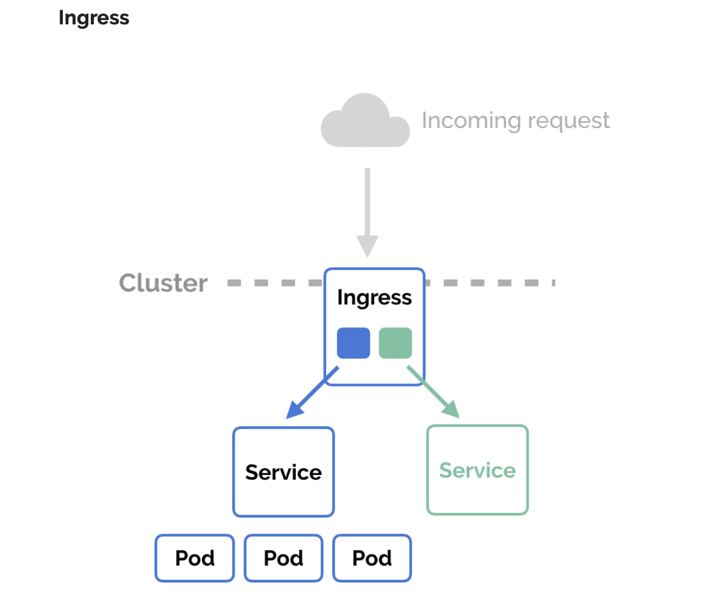

# kubernetes-examples

#### 说明

* 所有示例均在 Docker for Mac 内置的 Kubernetes 的集群上部署，请下载或更新到 Docker for Mac [最新版本](https://docs.docker.com/desktop/mac/release-notes/)。
* 动手实验前，请先执行 `kubectl config current-content` 查看当前集群名称，确保切换到本地的 Kubernetes 集群。
* 请勿用于生产环境。

#### 经典示例

> [安装 Ingress 控制器：ingress-nginx](./ingress-nginx) 是以下示例的前提条件。

* [ingress 路由使用示例](deploying-simple-apple-and-banana-ingress)
* [使用 Redis 部署 PHP 留言板应用程序](deploying-php-guestbook-application-with-redis)
* [使用 MongoDB 部署 PHP 留言板应用程序](deploying-php-guestbook-application-with-mongodb)
* [使用 Persistent Volumes 部署 WordPress 和 MySQL](deploying-wordpress-and-mysql-with-persistent-volumes)
* [使用 MongoDB 部署 Node.js 笔记应用程序](deploying-nodejs-note-application-with-mongodb)
* [部署 Laravel Demo Web 应用](deploying-laravel-application)
* [使用 MySQL 和 Redis 部署 Laravel 7 Demo Web 应用](deploying-laravel-7-with-mysql-and-redis)
* [使用 PHP-FPM 和 Nginx 部署一个简单的 phpinfo 应用](deploying-simple-php-app-with-fpm-and-nginx)
* [部署一个简单的 Go Web 应用](deploying-hello-world-web-application-with-go)
* [部署一个简单的 Gin 应用](deploying-simple-hello-gin-app)  
* [部署一个简单的 Flask 应用](deploying-simple-hello-flask-app)
* [部署一个简单的 Express 应用](deploying-simple-hello-express-app)
* [使用蓝绿发布策略部署一个 echo 应用](deploying-simple-echo-app-using-blue-green-deployment)
* [使用金丝雀发布策略部署一个 echo 应用](deploying-simple-echo-app-using-canary-deployment)
* [部署一个基本的 StatefulSet 应用](deploying-basic-statefulset-app)
* [部署一个 MySQL 集群 StatefulSet 应用](deploying-replicated-mysql-statefulset-app)
* [部署 KBP 日志应用](deploying-kbp-journal-app)
* [部署一个简单的加减乘除计算器微服务](deploying-simple-microservice-using-gin-and-grpc)

---

#### 本地安装多节点集群

* [vagrant-centos7-kubeadm](installing-kubernetes-with-deployment-tools)
* [vagrant-ubuntu18.04-kubeadm](cka-training/1.installing.md)

#### Certified Kubernetes Administrator (CKA) 

* [考试技巧](./cka-training/0.tips.md)
* [安装](./cka-training/1.installing.md)
* [Pod](./cka-training/2.pod.md)
* [故障排查](./cka-training/8.troubleshooting.md)

#### Istio

* [安装](istio/0.installing)
* [配置](istio/1.profile)
* [注入](istio/2.injection)
* [流量管理](istio/3.traffic-management)

#### Operator

* [memcached-operator](https://github.com/jxlwqq/memcached-operator)：源于 Operator Framework 官方示例
* [cnat-operator](https://github.com/jxlwqq/cnat-operator)：源于《Kubernetes 编程》示例
* [hello-operator](https://github.com/jxlwqq/hello-operator)：源于 Hello Kubernetes 示例
* [visitors-operator](https://github.com/jxlwqq/visitors-operator)：源于《Kubernetes 操作器》示例
* [wordpress-operator](https://github.com/jxlwqq/wordpress-operator)：源于 Kubernetes 官方文档示例 Wordpress
* [guestbook-operator](https://github.com/jxlwqq/guestbook-operator)：源于 Kubernetes 官方文档示例 Guestbook

#### Learn From Source Code

* [当你创建了一个 Deployment 时，Kubernetes 内部发生了什么？](./learn-from-source-code/what-happens-in-kubernetes-when-create-a-deployment.md)
* [当一个请求到达 kube-apiserver 时，Kubernetes 内部发生了什么？](./learn-from-source-code/what-happens-in-kubernetes-when-a-request-hits-kube-apiserver.md)
* [当一个 Pod 被调度时，Kubernetes 内部发生了什么？](./learn-from-source-code/what-happens-in-kubernetes-when-schedule-a-pod.md)
