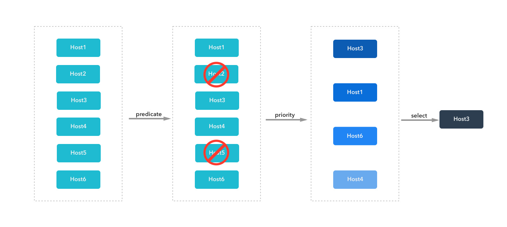

# 当一个 Pod 被调度时，Kubernetes 内部发生了什么？

在 Kubernetes 中，调度是指将 Pod 放置到合适的 Node 上，然后对应 Node 上的 Kubelet 才能够运行这些  Pod 。

kube-scheduler 是集群控制平面的主要组件之一。Kubernetes 通过它来决定如何调度集群中的 Pod。它会使用基于预选（断言 predicate）和基于优选（优先级 priority）的评分算法，根据集群中的约束以及用户指定的约束来优化资源。



### 预选（过滤）

kube-scheduler 首先使用**预选函数**来制定调度策略，决定 Pod 可以在哪些节点上进行调度。它意味着一个硬性约束条件，因此函数的返回值为布尔值。例如，一个 Pod 请求 10GB 的内存，而节点 A 的配置为 8 GB，那么节点 A 将返回 `false` 并从 Pod 的候选调度节点中剔除。另一个例子是节点 B 被集群管理员执行了 `kubectl cordon  node-b`，被标记节点为不可调度，它也将会被调度决策直接剔除。

调度程序会根据限制条件和复杂性依次进行以下预选检查，检查顺序存储在一个名为 predicatesOrdering （顺序断言）的切片中：

```go
var predicateOrdering = []string{
	CheckNodeUnschedulablePred,
	GeneralPred, HostNamePred, PodFitsHostPortsPred,
	MatchNodeSelectorPred, PodFitsResourcesPred, NoDiskConflictPred,
	PodToleratesNodeTaintsPred, CheckNodeLabelPresencePred,
	CheckServiceAffinityPred, MaxEBSVolumeCountPred, MaxGCEPDVolumeCountPred, MaxCSIVolumeCountPred,
	MaxAzureDiskVolumeCountPred, MaxCinderVolumeCountPred, CheckVolumeBindingPred, NoVolumeZoneConflictPred,
	EvenPodsSpreadPred, MatchInterPodAffinityPred,
}
```

* **CheckNodeUnschedulablePred**：检查节点是否可调度；
* **GeneralPred**：一般性检测，如检测资源是否充足，Pod 的 Host、Port、Selector 是否匹配；
* **HostNamePred**：检测 Pod 指定的 Node 名称是否和 Node 名称相同；
* **PodFitsHostPortsPred**：检查 Pod 请求的端口（网络协议类型）在节点上是否可用；
* **MatchNodeSelectorPred**：检测是否匹配 NodeSelector 节点选择器的设置；
* **PodFitsResourcesPred**：检查节点的空闲资源（例如，CPU 和内存）是否满足 Pod 的要求；
* **NoDiskConflictPred**：根据 Pod 请求的卷是否在节点上已经挂载，评估 Pod 和节点是否匹配；
* **PodToleratesNodeTaintsPred**：检查 Pod 的容忍是否能容忍节点的污点；
* **CheckNodeLabelPresencePred**：检测 NodeLabel 是否存在；
* **CheckServiceAffinityPred**：检测服务的亲和；
* **~~MaxEBSVolumeCountPred~~**：已废弃，检测 Volume 数量是否超过云服务商 AWS 的存储服务的配置限制；
* **~~MaxGCEPDVolumeCountPred~~**：已废弃，检测 Volume 数量是否是否超过云服务商 Google Cloud 的存储服务的配置限制；
* **MaxCSIVolumeCountPred**：Pod 附加 CSI 卷的数量，判断是否超过配置的限制；
* **~~MaxAzureDiskVolumeCountPred~~**：已废弃，检测 Volume 数量是否超过云服务商 Azure 的存储服务的配置限制；
* **~~MaxCinderVolumeCountPred~~**：已废弃，检测 Volume 数量是否超过云服务商 OpenStack 的存储服务的配置限制；
* **CheckVolumeBindingPred**,：基于 Pod 的卷请求，评估 Pod 是否适合节点，这里的卷包括绑定的和未绑定的 PVC 都适用；
* **NoVolumeZoneConflictPred**：给定该存储的故障区域限制， 评估 Pod 请求的卷在节点上是否可用；
* **EvenPodsSpreadPred**：检测 Node 是否满足拓扑传播限制；
* **MatchInterPodAffinityPred**：检测是否匹配 Pod 的亲和与反亲和的设置；

可以看出，Kubernetes 正在逐步移除某个具体云服务商的服务的相关代码，而使用接口（Interface）来扩展功能。


### 优选（打分）

预选通过返回 true 或者 false 来表示节点是否参与调度，而优选则是根据优先级的相对值对所有可调度节点进行排名，以下是为节点评分的优先级列表：

* **EqualPriority**：给予所有节点相等的权重；
* **MostRequestedPriority**：支持最多请求资源的节点。 该策略将 Pod 调度到整体工作负载所需的最少的一组节点上；
* **RequestedToCapacityRatioPriority**：使用默认的打分方法模型，创建基于 ResourceAllocationPriority 的 requestedToCapacity；
* **SelectorSpreadPriority**：属于同一 Service、 StatefulSet 或 ReplicaSet 的 Pod，尽可能地跨 Node 部署（鸡蛋不要只放在一个篮子里，分散风险，提高可用性）；
* **ServiceSpreadingPriority**：对于给定的 Service，此策略旨在确保该 Service 关联的 Pod 在不同的节点上运行。 它偏向把 Pod 调度到没有该服务的节点。 整体来看，Service 对于单个节点故障变得更具弹性；
* **InterPodAffinityPriority**：实现了 Pod 间亲和性与反亲和性的优先级；
* **LeastRequestedPriority**：偏向最少请求资源的节点。 换句话说，节点上的 Pod 越多，使用的资源就越多，此策略给出的排名就越低；
* **BalancedResourceAllocation**：偏向平衡资源使用的节点；
* **NodePreferAvoidPodsPriority**：根据节点的注解 scheduler.alpha.kubernetes.io/preferAvoidPods 对节点进行优先级排序。 你可以使用它来暗示两个不同的 Pod 不应在同一节点上运行；
* **NodeAffinityPriority**：根据节点亲和中 PreferredDuringSchedulingIgnoredDuringExecution 字段对节点进行优先级排序；
* **TaintTolerationPriority**：根据节点上无法忍受的污点数量，给所有节点进行优先级排序。 此策略会根据排序结果调整节点的等级；
* **ImageLocalityPriority**：偏向已在本地缓存 Pod 所需容器镜像的节点；
* **EvenPodsSpreadPriority**：实现了 Pod 拓扑扩展约束的优先级排序；


这些分值将会累计为节点的总分，用来表明其优先级。例如，如果一个 Pod 需要 1 个 cpu 核心的资源，而有两个候选节点满足这一要求，其中节点 A 有 2 个 CPU 核心可供分配，节点 B 有 4 个核心可供分配，则节点 B 将具有更高的优先级。 如果多个节点返回相同的优先级，调度程序将会使用轮循的方式来选择节点。

### 最优解

kube-scheduler 使用基于预选和基于优选的评分算法，理论上需要遍历所有 Node（实际上有缓存逻辑），而当集群中的 Node 数量超过一定数量后，调度算法的开销将变得很大。所以 kube-scheduler 为了解决性能问题，引入了"全局最优解"和"局部最优解"两种最优解。

* **全局最优解**：遍历集群中的所有节点，找出全局最优的节点；
* **局部最优解**：只遍历集群中的部分节点，找出局部最有的节点；

在小型集群中（例如 100 个节点），使用全局最优解。而在超大型集群中（例如 5000 个节点）使用局部最优解。

### 抢占机制

Pod 可以设置优先级（PriorityClass，**注意：此处的 Pod 优先级与优选算法的优先级评分不是一个概念**）。 Pod 优先级表示一个 Pod 相对于其他 Pod 的重要性。 如果一个 Pod 无法被调度，调度程序会尝试抢占（驱逐）较低优先级的 Pod。

要使用优先级和抢占，需要：

1. 新增 PriorityClass 对象，并设置 value 值；
2. 将 Pod 的 Spec.priorityClassName 设置为上述新增的 PriorityClass；

上述设置了高优先级的 Pod（暂称为 `pod-h`） ，如果 kube-scheduler 没有找到满足其指定要求的节点，则触发抢占逻辑。抢占逻辑试图找到某个节点，在该节点中删除/驱逐一个或多个优先级低于 `pod-h` 的 Pod。被驱逐的 Pod 消失后，`pod-h` 可以被调度到该节点上。


